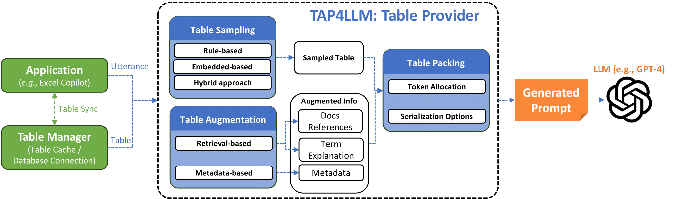

# Table meets LLM

**[UPDATE]**: **PLease check our latest version of relased code at https://github.com/microsoft/TableProvider/tree/main/table_provider.** The repo will be deprecated later!

**[UPDATE]**: We are excited our paper ["Table Meets LLM: Can Large Language Models Understand Structured Table Data? A Benchmark and Empirical Study"](https://dl.acm.org/doi/10.1145/3616855.3635752) has been accepted by WSDM'24!

**[UPDATE]**: We are excited our paper ["TAP4LLM: Table Provider on Sampling, Augmenting, and Packing Semi-structured Data for Large Language Model Reasoning"](https://arxiv.org/abs/2312.09039) has been accepted by EMNLP'24!

------------------

**Welcome to the Table Meets LLM repository!** This project encompasses two major components designed to advance the understanding and utilization of Large Language Models (LLMs) in handling structured table data. The repository aims to (1) release the **SUC** Benchmark along with comprehensive empirical studies from our [paper](https://dl.acm.org/doi/10.1145/3616855.3635752), and (2) provide the TAP4LLM Toolkit from our [paper](https://arxiv.org/abs/2312.09039), a versatile pre-processor suite for leveraging LLMs in table-based tasks effectively.


## SUC Benchmark

**SUC (Structured Understanding Capabilities)** is a comprehensive benchmark introduced to evaluate and detect the structural understanding capabilities of Large Language Models when interacting with table data. The benchmark comprises a variety of tasks designed with increasing difficulty levels to thoroughly assess different aspects of table comprehension and manipulation.

**Key Features**:
* *Diverse Datasets*: Supports multiple datasets such as TabFact, FEVEROUS, SQA, HybridQA, and ToTTo.
* *Flexible Task Settings*: Offers zero-shot, one-shot, and multiple input choice configurations to cater to various experimental setups.
* *Task Customization*: Allows customization through multiple arguments, enabling users to tailor the benchmark according to their specific research needs.
* *Empirical Studies*: Facilitates in-depth empirical analysis to understand how different input designs and configurations impact LLM performance on structured table tasks.

**Repository Structure**:
* [table_meets_llm/unified_benchmark_generate.sh](table_meets_llm/unified_benchmark_generate.sh): Main script for generating benchmark tasks with customizable settings.
* [table_meets_llm/unified_babel_convertor.sh](table_meets_llm/unified_babel_convertor.sh): Shell script containing examples of multiple argument configurations.
* [table_meets_llm/dataset_collection](table_meets_llm/dataset_collection): Code for dataset collection using Hugging Face datasets as dataloaders.
* [table_meets_llm/utils/structured_data_linearize.py](table_meets_llm/utils/structured_data_linearize.py): Serialization functions for various data linearization formats.

**Getting Started**:

To generate the SUC benchmark tasks, navigate to the 'table_meets_LLM' and execute the relevant Python scripts with desired arguments. For detailed command usage, refer to the [table_meets_llm/unified_benchmark_generate.sh](table_meets_llm/unified_benchmark_generate.sh) script and the inline help descriptions within [table_meets_llm/main/unified_benchmark_generator.py](table_meets_llm/main/unified_benchmark_generator.py). The code associated with downstream tasks can be found in [table_meets_llm/main/unified_babel_convertor.py](table_meets_llm/main/unified_babel_convertor.py). The downstream tasks setting support both manual prompting engineering and self-augmented prompting. Multiple prompt choices can be found in [table_meets_llm/main/config.py](table_meets_llm/main/config.py).


```bash
cd table_meets_llm

# generate table/databases downstream tasks
python unified_babel_convertor.py --task cosql dart tabfact feverous tabfact hybridqa spider totto sql2text logic2text sqa webqsp --objective zero --split train validation --unified --unified_file_output ./exps/downstream_tasks_20230113_log/

# generate self-augmented information
python unified_babel_convertor.py --task totto tabfact hybridqa sqa feverous --objective oneshot --heuristic heur_8 --split validation --unified --unified_file_output  ./exps/downstream_tasks_20230120_self_augmented_p2_log/heur_8  --linear_func html
python unified_babel_convertor.py --task totto tabfact hybridqa sqa feverous --objective oneshot --heuristic heur_9 --split validation --unified --unified_file_output ./exps/downstream_tasks_20230120_self_augmented_p2_log/heur_9  --linear_func html
python unified_babel_convertor.py --task totto tabfact hybridqa sqa feverous --objective oneshot --heuristic heur_10 --split validation --unified --unified_file_output ./exps/downstream_tasks_20230120_self_augmented_p2_log/heur_10 --linear_func html

# more detailed information can be found in unified_bael_convertor.sh
```

------------------------------
## TAP4LLM Toolkit

TAP4LLM (Table Provider for LLM) is a powerful toolkit designed to enhance the interaction between LLMs and structured table data. It provides optimized prompt designs and robust functionalities to ensure high-quality outputs when LLMs process table-related inputs.

**Core Components**:

* *Table Sampling*: Decomposes large tables into manageable sub-tables based on query semantics, ensuring relevant data is presented to the LLM.
* *Table Augmentation*: Enhances tables with additional knowledge from external sources and models, including metadata, structural information, and commonsense knowledge.
* *Table Packing and Serialization*: Converts tables into various serialized formats suitable for LLM prompts, supporting formats like HTML, Markdown, JSON, XML, and LaTeX.
* *Table Manager*: Manages table contexts and executes generated code against the tables, ensuring seamless integration with downstream tasks.



### Installation:

**1. Clone the repo and setup the environment**

```bash
cd table_provider
pip install -r requirementx.txt
```

**2. Prepare the validation/text data**

* The toolkit is evaluated on five public datasets: FEVEROUS, HybridQA, SQA, TabFact, and ToTTo.
* Follow the loading scripts located at [dataset_collection](table_provider/table_provider/data_loader/scripts/dataset_collection) to prepare the data.
* To add a new dataset, create a loading script in the scripts directory and update [the config](table_provider/table_provider/contract/enum_type.py) by adding the new dataset name to the TaskName class.

**(Optional)3. To enable Metadata for table augmentation**

* Download the pretrained weights of Metadata model from [the link](https://drive.google.com/file/d/1gmJlPQLhYLFoJkyXADJRetIja0dLAp9R/view?usp=drive_link)!
* Copy the weights to [table_provider/table_provider/agents/Metadata/model/model](table_provider/table_provider/agents/Metadata/model/model)!

### Usage:

**1. Format of the GPT-x (GPT-4, GPT-3.5-turbo, etc) input**

Inputs should be in JSONL format:

```json
{"prompt": "xxxxx", "label": "xxx"}
{"prompt": "xxxxx", "label": "xxx"}
{"prompt": "xxxxx", "label": "xxx"}
{"prompt": "xxxxx", "label": "xxx"}
```

Where the **'prompt'** refers to the input for the GPT-x (GPT-4, GPT-3.5-turbo, etc), and the **'label'** refers to the ground truth answer corresponding to the user query.

**2. Generate the jsonl files**

```bash
bash scripts/end2end.sh
```

By default, the output will be stored at [pipeline/data/Exp-{TimeStamp}](table_provider/pipeline/data). If you intend to specify this parameter, please also set up in [table_provider/pipeline/end2end.py](table_provider/pipeline/end2end.py).

**3. Modify the TableProvider Components**
Refer to [table_provider/dataframe](table_provider/table_provider/dataframe) for each component's implementations. Each file corresponds to a specific component within TAP4LLM.

# Contributing

We welcome contributions to enhance both the SUC Benchmark and the TAP4LLM Toolkit. Please follow the standard contribution guidelines to get started.

## License

This project is licensed under the MIT License.

## Contact

For questions, issues, or feature requests, please open an issue on the repository or contact the maintainers at yuansui08@gmail.com.

Thank you for exploring the Table Meets LLM repository! We hope these tools and benchmarks empower your research and applications involving structured table data and Large Language Models.

--------------------------------
# References

```bash
@article{sui2023table,
  title     = {Table Meets LLM: Can Large Language Models Understand Structured Table Data? A Benchmark and Empirical Study},
  author    = {Yuan Sui and Mengyu Zhou and Mingjie Zhou and Shi Han and Dongmei Zhang},
  journal   = {Web Search and Data Mining},
  year      = {2023},
  doi       = {10.1145/3616855.3635752},
  bibSource = {Semantic Scholar https://www.semanticscholar.org/paper/f534f566535f4e0fd2b72b1db3b18c47479e5092}
}

@article{sui2023tap4llm,
  title     = {TAP4LLM: Table Provider on Sampling, Augmenting, and Packing Semi-structured Data for Large Language Model Reasoning},
  author    = {Yuan Sui and Jiaru Zou and Mengyu Zhou and Xinyi He and Lun Du and Shi Han and Dongmei Zhang},
  journal   = {Conference on Empirical Methods in Natural Language Processing},
  year      = {2023},
  doi       = {10.48550/arXiv.2312.09039},
  bibSource = {Semantic Scholar https://www.semanticscholar.org/paper/00a67af3b7dc785b4813b61d232cc76b4fb2b189}
}
```
